# Autonomous Driving: Pedestrians and Vehicles Detection using YOLOv11

This project is part of the Data Science and AI Course at Faculty of Electrical Engineering Sarajevo. We utilize the YOLO (You Only Look Once) object detection model to detect pedestrians and vehicles in driving scenarios, classify traffic lights and track lane, primarily using dashcam footage and images. Different configurations and sizes of the YOLO model were explored to evaluate performance. 

**Team Members:**
* [Emin Hadžiabdić] - ([GitHub Profile](https://github.com/ehadziabdic))
* [Armin Memišević] - ([GitHub Profile](https://github.com/arminn2206))
* [Muhamed Pašić] - ([GitHub Profile](https://github.com/MuhaxD))
* [Bakir Kosovac] - ([GitHub Profile](https://github.com/bkosovac1))

---
## Datasets

[Pedestrian and Vehicle Detection](https://docs.ultralytics.com/datasets/detect/coco/) 
We did not train model for pedestrian and vehicle detection because YOLOv11 model is pre-trained on COCO dataset. It consists of approximately 330K frames capturing many classes, but primary annotated classes relevant to this project are `pedestrian`, `car`, `truck`, `bus`, `motorcycle`, `bicycle`. 

[Traffic Lights Detection](https://universe.roboflow.com/avenue-oqzgk/traffic-light-detection-vfr2s) 
The dataset used for training and evaluation of traffic lights detectionwas sourced from RoboFlow. It consists of approximately 732 frames of traffic lights and classes relevant to this project are `green-lights`, `red-lights`, `yellow-lights`

[Lane Segmentation](https://universe.roboflow.com/jk-nanu0/final2-xiiin) 
The dataset used for training and evaluation was sourced from RoboFlow. It consists of approximately 1927 frames capturing roads and side-lines. Classes are `lane` and `road`.

## Training 
Training was done on nano and large size of YOLOv11 model. The training process was optimised with recommended optimizer for that specific dataset.
Following are the training parameters and results of all models. 
Training was conducted using various sizes of the YOLOv11 model (`nano` and `large`). Key training parameters and validation results are summarized below:

|         **Model**        | **YOLO Size** | **Epochs** | **Batch Size** | **Learning Rate** |  **Optimizer**  | **Momentum** |  **Dropout**  | **Precision (P)** | **Recall (R)** | **mAP50** | **mAP50-95** |
|:------------------------:|:-------------:|:----------:|:--------------:|:-----------------:|:---------------:|:------------:|:-------------:|:-----------------:|:--------------:|:---------:|:------------:|
| Traffic Lights Detection |    `large`    |    `50`    |      `16`      |     `0.001429`    |  `Auto: AdamW`  |     `0.9`    |     `0.0`     |      `81.4%`      |     `87.4%`    |  `91.0%`  |    `47.9%`   | 
| Traffic Lights Detection |    `nano`     |    `100`   |      `64`      |     `0.001429`    |  `Auto: AdamW`  |     `0.9`    |     `0.0`     |      `91.1%`      |     `89.2%`    |  `94.1%`  |    `50.1%`   | 
|     Lane Segmentation    |    `large`    |    `50`    |      `16`      |     `0.001667`    |  `Auto: AdamW`  |     `0.9`    |     `0.0`     |      `83.2%`      |     `86.4%`    |  `85.8%`  |    `77.2%`   | 
|     Lane Segmentation    |    `nano`     |    `100`   |      `64`      |     `0.001667`    |  `Auto: AdamW`  |     `0.9`    |     `0.0`     |      `82.9%`      |     `88.9%`    |  `86.8%`  |    `78.7%`   |

## Results
Below are some key performance indicators and visualizations from our training runs.

### 1. Traffic Lights Detection with Large YOLOv11 model (ID 1)

* **Precision-Confidence Curve:**

    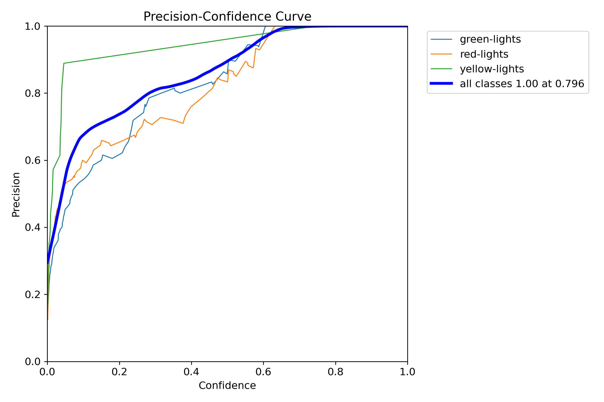

* **Recall-Confidence Curve:**

    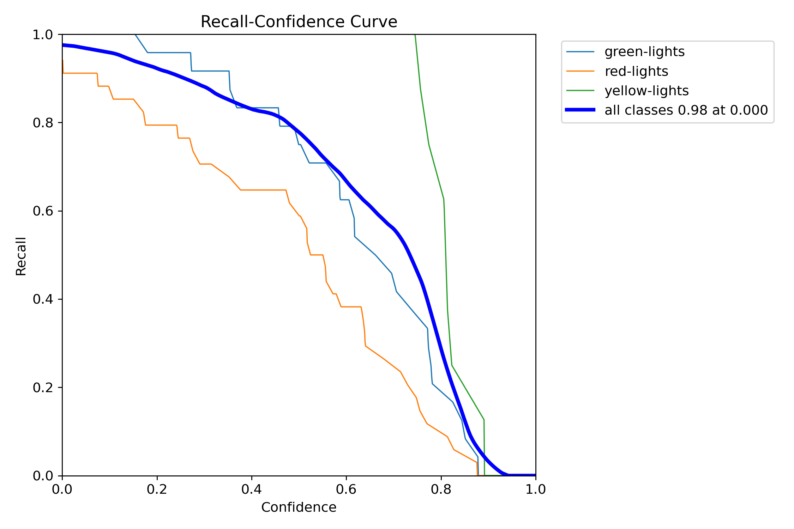

* **Precision-Recall Curve:**

    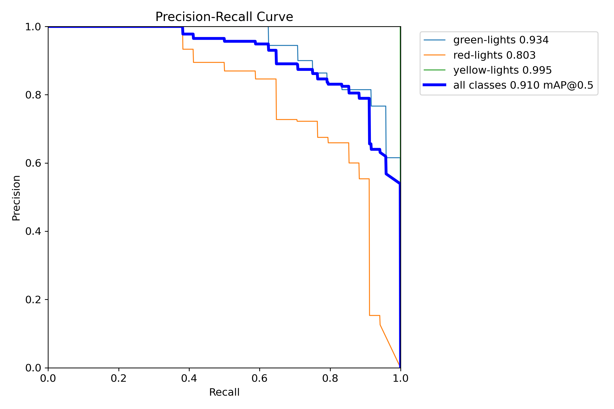

* **Confusion Matrix:**

    

* **Results:**

    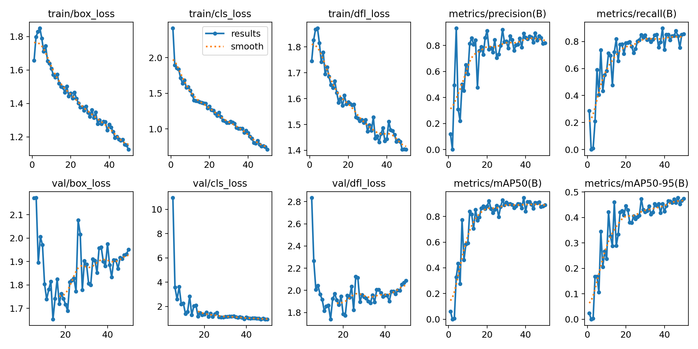

* **Example Detections:**

    - Model Labels

    

    - Model Prediction

    

### 2. Traffic Lights Detection with Nano YOLOv11 model (ID 2)

* **Precision-Confidence Curve:**

    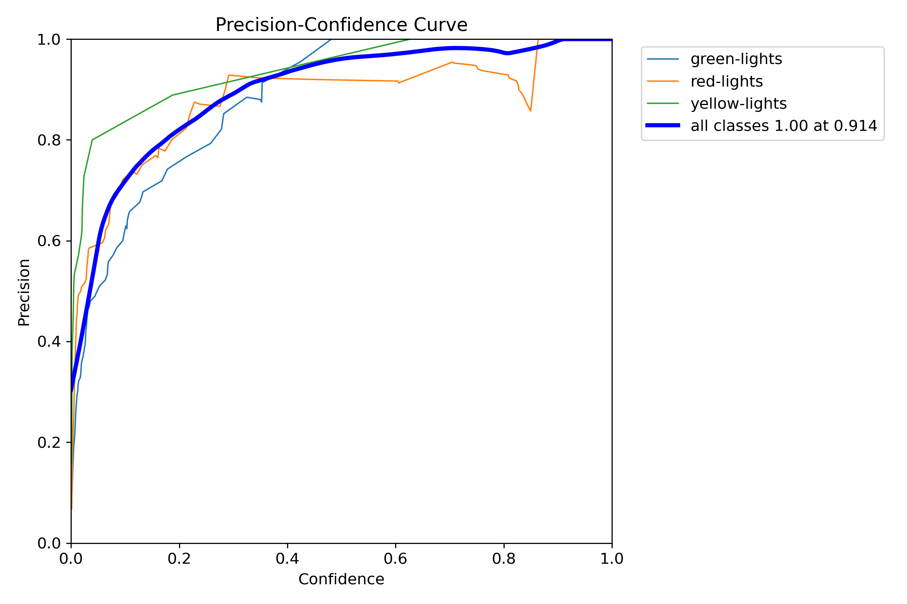

* **Recall-Confidence Curve:**

    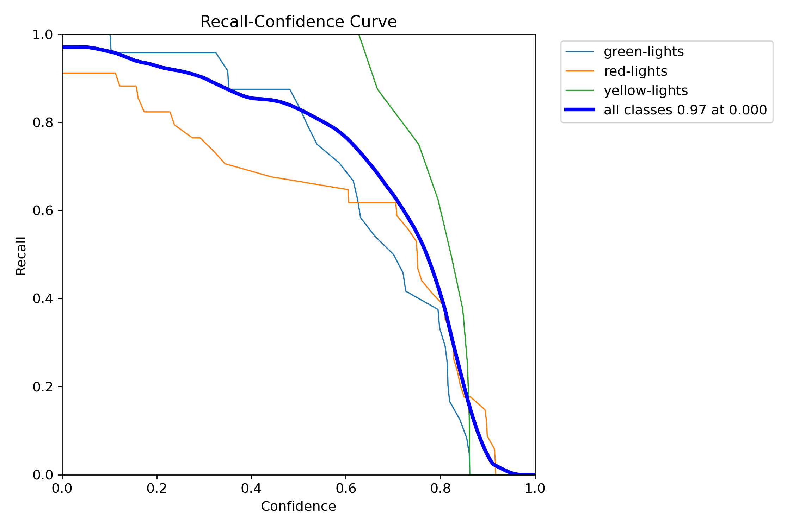

* **Precision-Recall Curve:**

    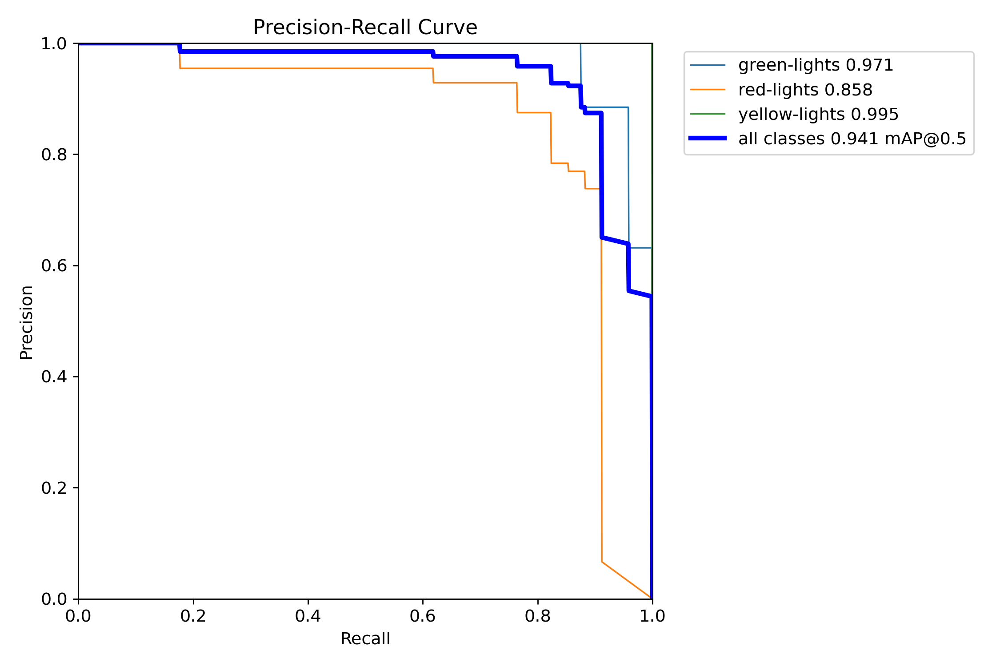

* **Confusion Matrix:**

    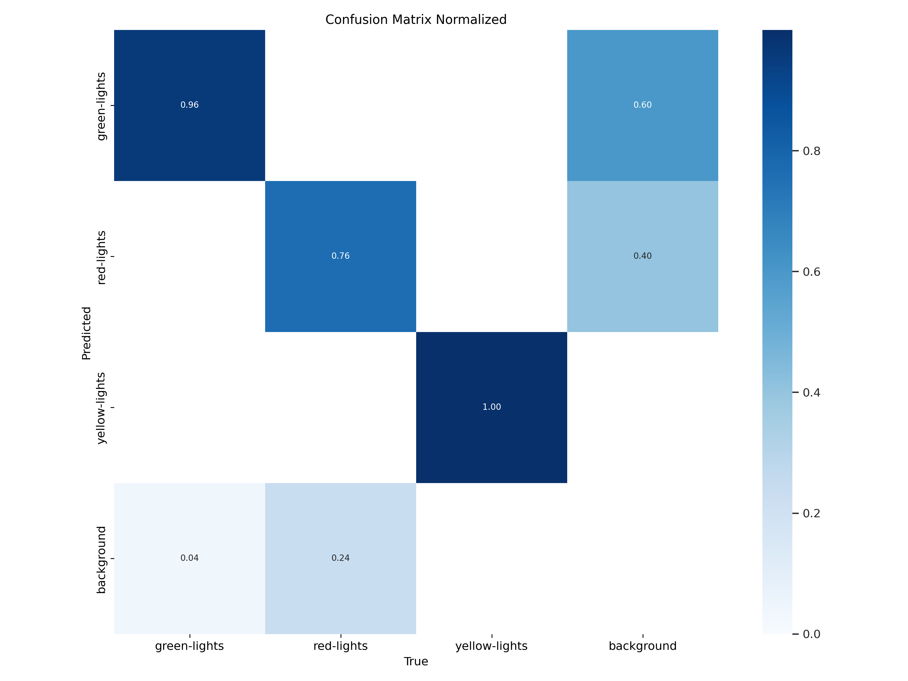

* **Results:**

    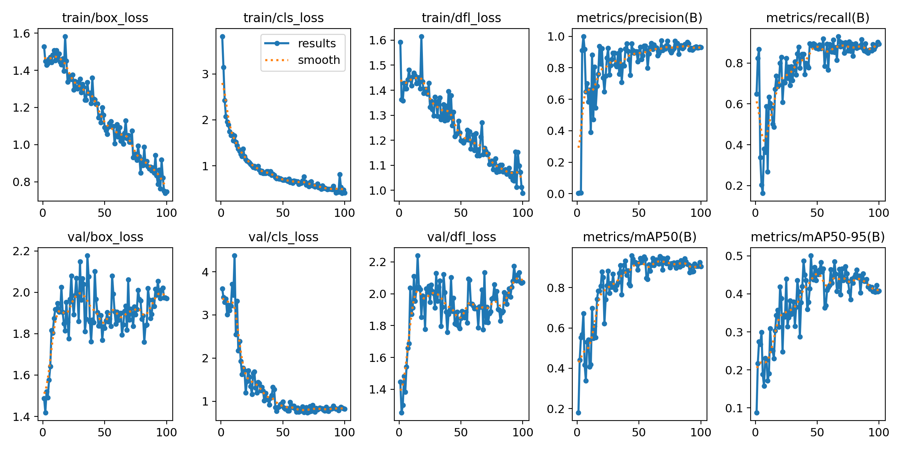

* **Example Detections:**

    - Model Labels

    

    - Model Prediction

    

### 3. Lane Segmentation with Large YOLOv11 model (ID 3)

* **Precision-Confidence Curve:**

    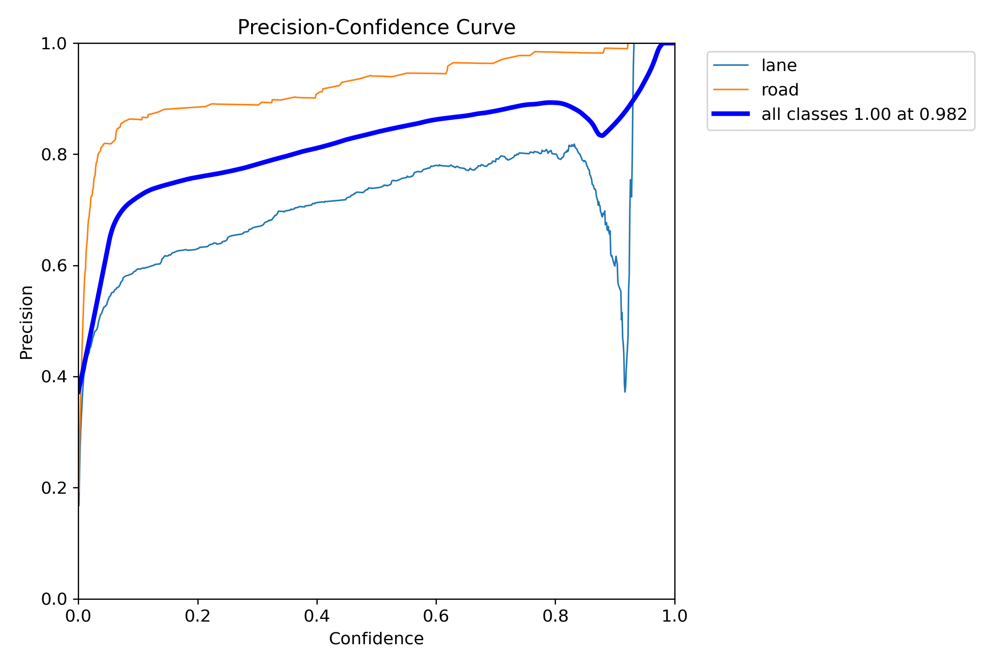

* **Recall-Confidence Curve:**

    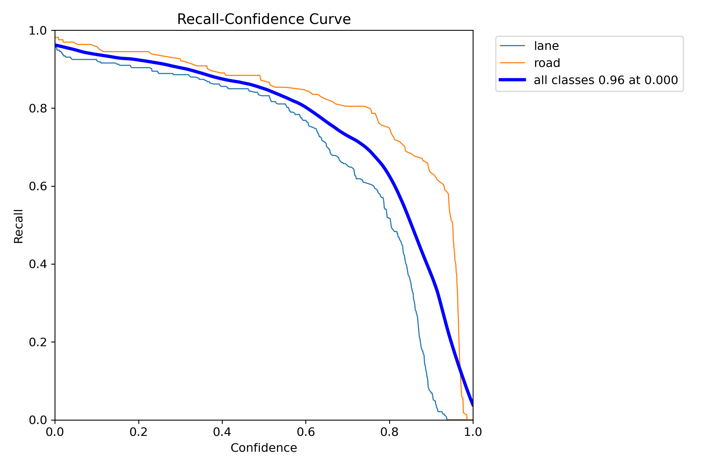

* **Precision-Recall Curve:**

    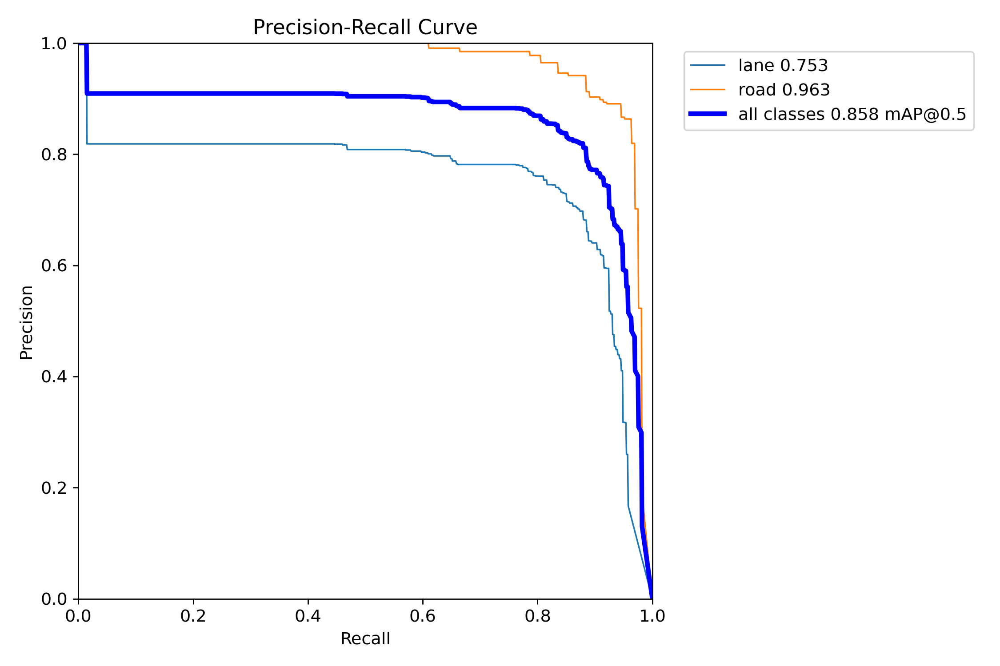

* **Confusion Matrix:**

    

* **Results:**

    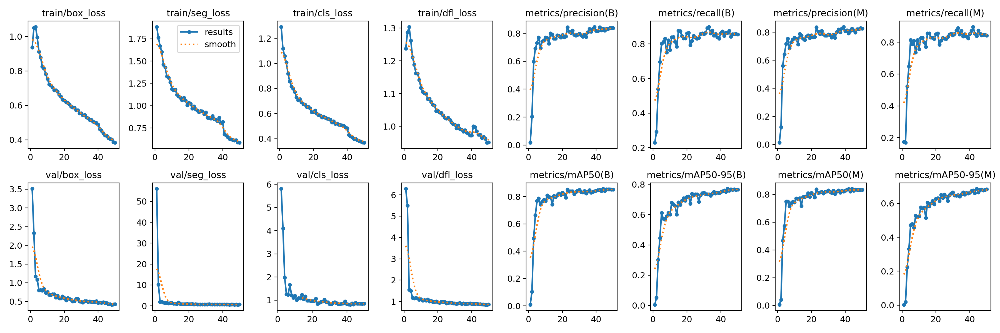

* **Example Detections:**

    - Model Labels

    

    - Model Prediction

    

### 4. Lane Segmentation with Nano YOLOv11 model (ID 4)

* **Precision-Confidence Curve:**

    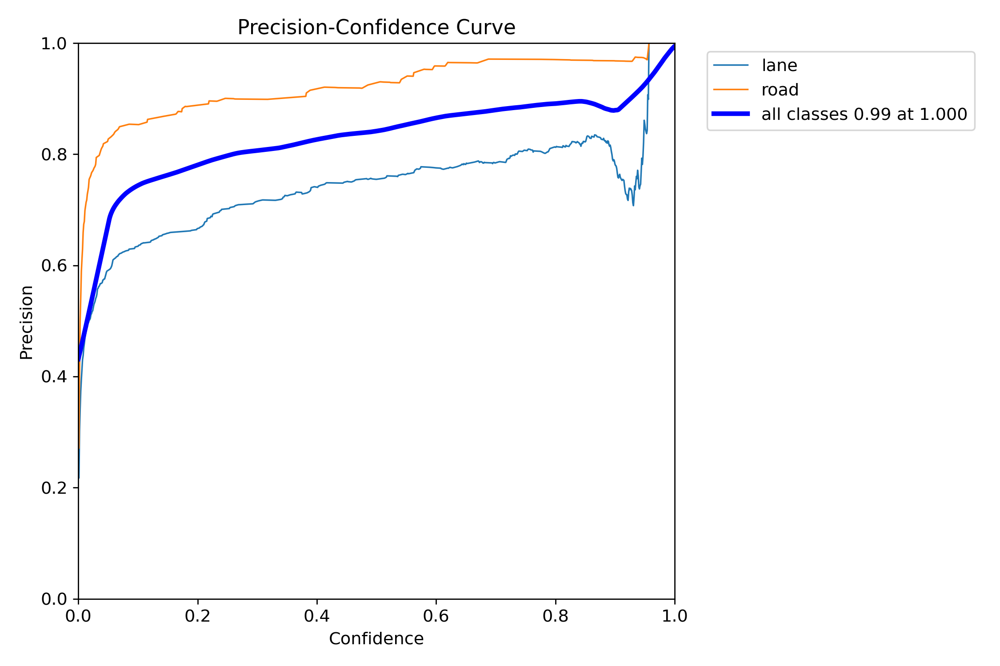

* **Recall-Confidence Curve:**

    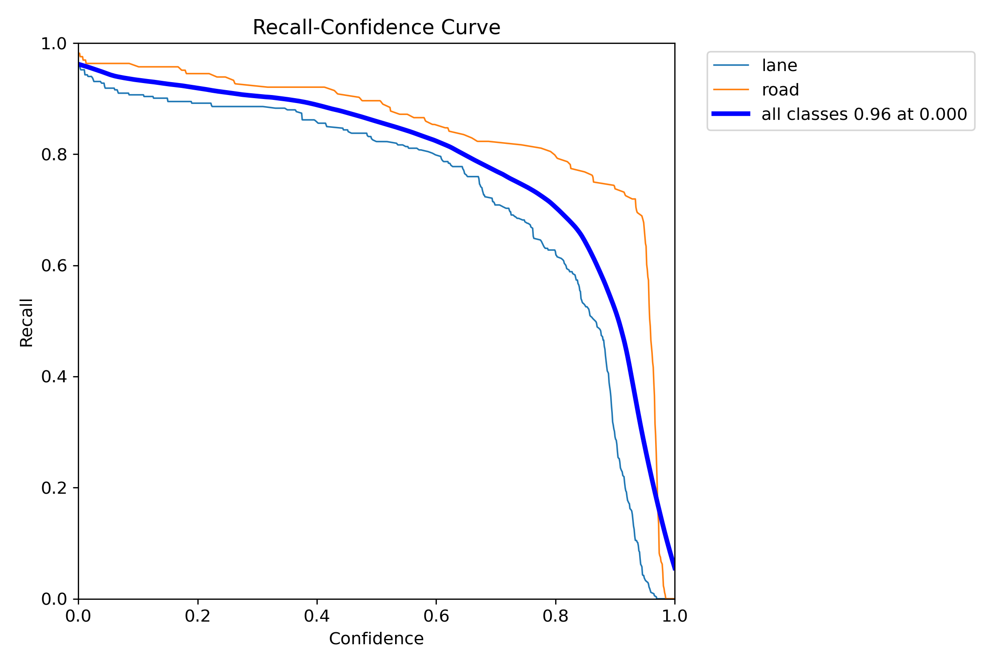

* **Precision-Recall Curve:**

    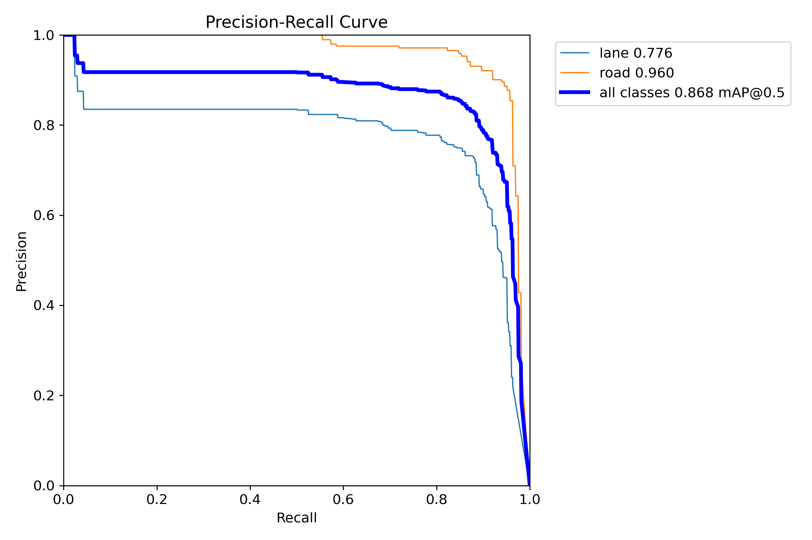

* **Confusion Matrix:**

    

* **Results:**

    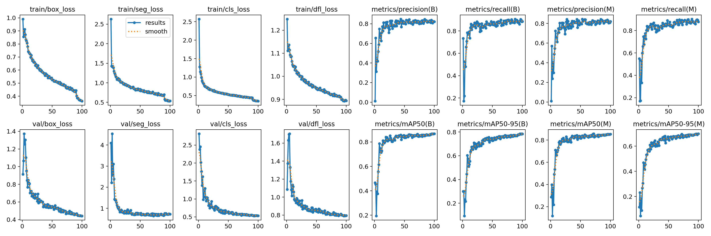

* **Example Detections:**

    - Model Labels

    

    - Model Prediction
    
    